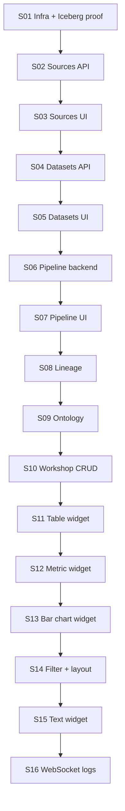

# ATLAS Phase 1 — Build Plan

Vertical slices, strictly ordered. Each slice ends in **running software**. No slice may depend on a later slice to function.

**Rules:**

- One slice per coding session (see [`.cursor/rules`](../.cursor/rules)).
- De-risk PyIceberg + DuckDB + MinIO before building domain features.
- Backend slices are curl-verifiable; UI slices add browser checks.
- No placeholder routes, pages, or sidebar items outside the current slice.

Canonical spec: [`SPEC.md`](SPEC.md). Decisions: [`DECISIONS.md`](DECISIONS.md).



## Risk register

| Risk | Retired in |
|------|------------|
| PyIceberg SQL catalog config against Postgres | S01 |
| DuckDB iceberg extension + MinIO path-style S3 | S01 |
| CTE builder correctness (parameterization, derive wrapping) | S06 |
| React Flow state sync (pipeline, lineage, ontology canvases) | S07 (primary), S08, S09 |
| Celery + DB session handling (async API vs sync worker) | S06 |

---

## S01 — Infrastructure, schema, Iceberg round-trip proof

### Scope

- `docker-compose.yml`, `.env.example`, `.gitignore`
- `backend/Dockerfile`, `backend/requirements.txt`
- `backend/app/main.py` — FastAPI app, CORS
- `backend/app/config.py` — pydantic-settings
- `backend/app/database.py` — async SQLAlchemy engine + session factory
- `backend/app/dependencies.py` — `get_db`, stubs for later deps
- `backend/app/api/v1/router.py` — health route only
- `backend/app/api/envelope.py` — `{ data, error, meta }` helpers
- `backend/alembic/` — initial migration with **all** tables from SPEC (tenancy, audit, lineage_event_inputs, widgets.deleted_at, no CASCADE)
- `backend/scripts/prove_iceberg_roundtrip.py` — PyArrow → PyIceberg → MinIO → DuckDB read-back
- `backend/app/compute/base.py` — ComputeEngine Protocol
- `backend/app/compute/duckdb_engine.py` — minimal read/write for proof script
- `backend/app/compute/spark_engine.py` — NotImplementedError stub
- `backend/app/catalog/iceberg_catalog.py` — PyIceberg SQL catalog init

### Out of scope

Domain routes (sources, datasets, etc.), frontend, Celery worker, connectors, domain services.

### Acceptance checks

```bash
docker compose up -d
docker compose ps
# Expect postgres, redis, minio healthy

cd backend && alembic upgrade head

curl -s http://127.0.0.1:8000/api/v1/health | jq '.data.status'
# Expect: "ok"

curl -s http://127.0.0.1:8000/api/v1/health | jq '.error'
# Expect: null

python backend/scripts/prove_iceberg_roundtrip.py
# Expect: exit 0, printed row count match
```

### Stop condition

Any of: compose service unhealthy, migration fails, health not HTTP 200 with envelope, round-trip script fails, DuckDB cannot read Iceberg from MinIO with path-style S3.

---

## S02 — Data Sources API

### Scope

- `backend/app/models/source.py`, `backend/app/models/audit.py`
- `backend/app/schemas/source.py`
- `backend/app/services/audit_service.py`, `backend/app/services/source_service.py`
- `backend/app/api/v1/sources.py`
- `backend/app/connectors/base.py`
- `backend/app/connectors/csv_connector.py`
- `backend/app/connectors/parquet_connector.py`
- `backend/app/connectors/postgres_connector.py`
- `backend/app/connectors/stub_connectors.py`
- `backend/tests/test_response_envelope.py`
- Wire sources router into `router.py`

### Out of scope

Frontend, datasets, pipelines, upload UI.

### Acceptance checks

```bash
# Create CSV source
curl -s -X POST http://127.0.0.1:8000/api/v1/sources \
  -H 'Content-Type: application/json' \
  -d '{"name":"demo_csv","source_type":"csv","config":{}}' | jq '.error'
# Expect: null

SOURCE_ID=$(curl -s -X POST http://127.0.0.1:8000/api/v1/sources \
  -H 'Content-Type: application/json' \
  -d '{"name":"demo_csv2","source_type":"csv","config":{}}' | jq -r '.data.id')

# Upload CSV
echo "id,name\n1,alpha" > /tmp/sample.csv
curl -s -X POST "http://127.0.0.1:8000/api/v1/sources/${SOURCE_ID}/upload" \
  -F 'file=@/tmp/sample.csv' | jq '.data.uploaded'
# Expect: true

# Schema discovery
curl -s "http://127.0.0.1:8000/api/v1/sources/${SOURCE_ID}/schema" | jq '.data.tables[0].columns'
# Expect: column list including name

# Empty file rejected
touch /tmp/empty.csv
curl -s -o /dev/null -w "%{http_code}" -X POST \
  "http://127.0.0.1:8000/api/v1/sources/${SOURCE_ID}/upload" \
  -F 'file=@/tmp/empty.csv'
# Expect: 400

# Soft delete
curl -s -X DELETE "http://127.0.0.1:8000/api/v1/sources/${SOURCE_ID}"
curl -s -o /dev/null -w "%{http_code}" "http://127.0.0.1:8000/api/v1/sources/${SOURCE_ID}"
# Expect: 404

pytest backend/tests/test_response_envelope.py -q
# Expect: all pass
```

### Stop condition

Credentials in logs or API responses; soft-deleted source returned on GET; empty or oversize upload accepted; stub connector returns HTTP 200 with error in body.

---

## S03 — Sources UI

### Scope

- `frontend/package.json`, Vite, Tailwind, shadcn init, strict `tsconfig.json`
- `frontend/src/main.tsx`, `frontend/src/router.tsx`
- `frontend/src/api/client.ts`, `frontend/src/api/sources.ts`
- `frontend/src/components/layout/AppShell.tsx`, `Sidebar.tsx`, `TopBar.tsx`
- `frontend/src/components/sources/SourceCard.tsx`, `SourceForm.tsx`, `SchemaExplorer.tsx`
- `frontend/src/pages/Sources.tsx`, `SourceDetail.tsx`
- Routes: `/` → `/sources`, `/sources`, `/sources/$id` only
- Sidebar: **Sources** nav item only

### Out of scope

Other sidebar modules, datasets pages, stub routes.

### Acceptance checks

1. Open app in browser → Sources list shows skeleton, then data.
2. Create CSV source via form → appears in list.
3. On source detail: upload `/tmp/sample.csv` → click Discover Schema → columns visible in SchemaExplorer.
4. Create PostgreSQL source → Test Connection shows success or failure badge (not stuck loading).
5. Inspect browser network tab: no axios calls from components except via TanStack Query hooks.

### Stop condition

Direct axios in components; `any` types; sidebar links to unbuilt modules; blank list with no skeleton.

---

## S04 — Datasets API (ingest + preview + profile)

### Scope

- `backend/app/models/dataset.py`, `backend/app/models/lineage.py`
- `backend/app/schemas/dataset.py`
- `backend/app/services/dataset_service.py`
- `backend/app/services/lineage_service.py` (ingest writes only)
- `backend/app/api/v1/datasets.py`
- Extend DuckDBEngine for preview/profile

### Out of scope

Pipeline execution, frontend, full lineage graph API.

### Acceptance checks

```bash
# Assume SOURCE_ID with uploaded sample.csv from S02/S03
curl -s -X POST http://127.0.0.1:8000/api/v1/datasets/ingest \
  -H 'Content-Type: application/json' \
  -d "{\"source_id\":\"${SOURCE_ID}\",\"table_or_file\":\"sample.csv\",\"dataset_name\":\"orders\",\"display_name\":\"Orders\",\"mode\":\"create\"}" \
  | jq '.data.row_count'
# Expect: > 0

DATASET_ID=$(curl -s http://127.0.0.1:8000/api/v1/datasets | jq -r '.data[0].id')

curl -s "http://127.0.0.1:8000/api/v1/datasets/${DATASET_ID}/preview?limit=5" | jq '.data.rows | length'
# Expect: <= 5

curl -s "http://127.0.0.1:8000/api/v1/datasets/${DATASET_ID}/profile" | jq '.data.columns[0].distinct_count'
# Expect: number

# Ingest from soft-deleted source → 400
curl -s -o /dev/null -w "%{http_code}" -X POST http://127.0.0.1:8000/api/v1/datasets/ingest \
  -H 'Content-Type: application/json' \
  -d "{\"source_id\":\"${DELETED_SOURCE_ID}\",\"table_or_file\":\"x.csv\",\"dataset_name\":\"bad\",\"display_name\":\"Bad\",\"mode\":\"create\"}"
# Expect: 400

docker compose exec postgres psql -U atlas -d atlas -c \
  "SELECT event_type FROM lineage_events WHERE target_dataset_id='${DATASET_ID}';"
# Expect: ingest
```

### Stop condition

Ingest without lineage_events/audit_events rows; inactive or soft-deleted source ingest succeeds; preview fails on normal string data.

---

## S05 — Datasets UI

### Scope

- `frontend/src/api/datasets.ts`
- `frontend/src/types/dataset.ts`
- `frontend/src/components/datasets/DatasetCard.tsx`, `DataPreview.tsx`
- `frontend/src/pages/Datasets.tsx`, `DatasetDetail.tsx`
- Add **Datasets** to sidebar

### Out of scope

Pipeline, lineage, ontology, workshop pages.

### Acceptance checks

1. Browser: from Source detail, trigger ingest (or from Datasets page) → new dataset appears in list.
2. Open dataset detail → preview table renders rows.
3. Profile section shows column stats (distinct_count, null_count, etc.).
4. Confirm dataset list uses TanStack Query (refetch on navigate, skeleton while loading).

### Stop condition

Cannot ingest or preview from UI; server state stored in Zustand.

---

## S06 — Pipeline backend (validation, CTE, Celery, log polling)

### Scope

- `backend/app/pipeline/validator.py`, `transforms.py`, `executor.py`
- `backend/app/models/pipeline.py`
- `backend/app/schemas/pipeline.py`
- `backend/app/services/pipeline_service.py`
- `backend/app/api/v1/pipelines.py`
- `backend/app/workers/celery_app.py`, `tasks.py`
- `backend/tests/test_dag_validation.py`, `test_transform_sql.py`
- Add `worker` service to `docker-compose.yml`
- Redis log list `pipeline:logs:{run_id}`
- Sync DB session in worker (DECISIONS A2)

### Out of scope

Pipeline builder UI, WebSocket, join/aggregate transforms.

### Acceptance checks

```bash
# Create pipeline (filter → output); use DATASET_ID from S04
curl -s -X POST http://127.0.0.1:8000/api/v1/pipelines \
  -H 'Content-Type: application/json' \
  -d @/tmp/filter_pipeline.json | jq '.data.id'

PIPELINE_ID=...
curl -s -X POST "http://127.0.0.1:8000/api/v1/pipelines/${PIPELINE_ID}/run" | jq '.data.status'
# Expect: "queued"

RUN_ID=$(curl -s -X POST "http://127.0.0.1:8000/api/v1/pipelines/${PIPELINE_ID}/run" | jq -r '.data.run_id')
# Poll until success
curl -s "http://127.0.0.1:8000/api/v1/pipelines/runs/${RUN_ID}" | jq '.data.status'
# Expect: "success"

curl -s "http://127.0.0.1:8000/api/v1/pipelines/runs/${RUN_ID}/logs?since=0" | jq '.data.lines | length'
# Expect: > 0

# Cycle DAG → 400 before queue
pytest backend/tests/test_dag_validation.py backend/tests/test_transform_sql.py -q
# Expect: all pass
```

### Stop condition

Celery task fails with no run record update; logs unavailable via HTTP; validator accepts cycle or multiple outputs; filter values string-interpolated into SQL.

---

## S07 — Pipeline UI

### Scope

- `frontend/src/api/pipelines.ts`, `frontend/src/types/pipeline.ts`
- `frontend/src/pages/Pipelines.tsx`, `PipelineDetail.tsx`
- `frontend/src/components/pipelines/PipelineCard.tsx`, `RunStatusBadge.tsx`, `RunLog.tsx`
- `frontend/src/components/pipelines/builder/` — Canvas, NodePalette, NodeConfigPanel, SourceNode, TransformNode, OutputNode
- Route: `/pipelines`, `/pipelines/$id`, `/pipelines/$id/builder`
- Add **Pipelines** to sidebar

### Out of scope

WebSocket logs, join/aggregate nodes in palette.

### Acceptance checks

1. Browser: open pipeline builder → drag Source → Filter → Output → configure filter → Save.
2. Reload builder page → DAG persisted (nodes and edges intact).
3. Click Run → status badge: queued → running → success.
4. Run log panel shows lines from polling endpoint.

### Stop condition

Canvas state lost on save/reload; run triggered without persisted DAG; React Flow nodes missing after refresh.

---

## S08 — Lineage API + UI

### Scope

- `backend/app/schemas/lineage.py`
- `backend/app/services/lineage_service.py` (graph queries)
- `backend/app/api/v1/lineage.py`
- `frontend/src/api/lineage.ts`, `frontend/src/types/lineage.ts`
- `frontend/src/stores/lineage-store.ts`
- `frontend/src/components/lineage/LineageGraph.tsx`, `LineageNode.tsx`, `LineageDetailPanel.tsx`
- `frontend/src/pages/Lineage.tsx`, `DatasetLineagePage` (or route variant)
- Routes: `/lineage`, `/lineage/dataset/$id`
- Add **Lineage** to sidebar

### Out of scope

Building graph from Iceberg snapshots as primary source.

### Acceptance checks

```bash
curl -s http://127.0.0.1:8000/api/v1/lineage/graph | jq '.data.nodes | length'
# Expect: >= 3 after ingest + pipeline from prior slices

curl -s "http://127.0.0.1:8000/api/v1/lineage/dataset/${DATASET_ID}?hops=3" | jq '.data.edges'
# Expect: non-empty edge array
```

Browser:

1. Lineage canvas shows blue (dataset), green (source), orange (pipeline) styled nodes.
2. Click dataset node → panel shows row count, last 5 runs, snapshot history link/section.
3. Click pipeline → "View Pipeline" navigates to pipeline detail.

### Stop condition

Graph derived from snapshot history instead of lineage_events; default unstyled React Flow nodes.

---

## S09 — Ontology API + UI

### Scope

- `backend/app/models/ontology.py`
- `backend/app/schemas/ontology.py`
- `backend/app/services/ontology_service.py`
- `backend/app/api/v1/ontology.py`
- `frontend/src/api/ontology.ts`, `frontend/src/types/ontology.ts`
- `frontend/src/components/ontology/OntologyGraph.tsx`, `ObjectTypeForm.tsx`, `PropertyMapper.tsx`, `ObjectBrowser.tsx`
- `frontend/src/pages/Ontology.tsx`, `ObjectTypeDetail.tsx`
- Routes: `/ontology`, `/ontology/types/$id`
- Add **Ontology** to sidebar
- Link traversal API only (no traversal UI)

### Out of scope

Link traversal UI; join inference.

### Acceptance checks

```bash
# Create object type + properties via API or prior UI setup
curl -s "http://127.0.0.1:8000/api/v1/ontology/types/${TYPE_ID}/objects" | jq '.error'
# Before PK set: Expect non-null error, HTTP 400

# After PK set and mappings complete
curl -s "http://127.0.0.1:8000/api/v1/ontology/types/${TYPE_ID}/objects?page=1" | jq '.meta.total'
# Expect: >= 1
```

Browser:

1. Create object type → add properties via Property Mapper (dataset + column).
2. Set primary key on type → Object Browser shows paginated rows.
3. Ontology graph renders object types and link edges with dagre layout.

### Stop condition

Partial multi-dataset results without full PK mapping; silent empty browser when PK missing (must show error).

---

## S10 — Workshop: Dashboard CRUD

### Scope

- `backend/app/models/analytics.py`
- `backend/app/schemas/analytics.py`
- `backend/app/services/analytics_service.py` (CRUD only, no widget data query)
- `backend/app/api/v1/analytics.py` (dashboard + widget CRUD)
- `frontend/src/api/analytics.ts`, `frontend/src/types/analytics.ts`
- `frontend/src/pages/Workshop.tsx`, `DashboardBuilder.tsx` (empty canvas OK)
- Route: `/workshop`, `/workshop/$id/edit`
- Add **Workshop** to sidebar

### Out of scope

`POST /analytics/widgets/{id}/data`; public publish routes; viewer route (S14).

### Acceptance checks

```bash
curl -s -X POST http://127.0.0.1:8000/api/v1/analytics/dashboards \
  -H 'Content-Type: application/json' \
  -d '{"name":"Ops"}' | jq '.data.id'

DASH_ID=...
curl -s -X POST "http://127.0.0.1:8000/api/v1/analytics/dashboards/${DASH_ID}/widgets" \
  -H 'Content-Type: application/json' \
  -d '{"widget_type":"table","title":"Preview","config_json":{},"data_binding_json":null}' | jq '.data.id'
```

Browser:

1. Create dashboard from Workshop list → opens builder.
2. Add widget to layout JSON → Save → reload → layout persists.

### Stop condition

Widget data endpoint implemented; `/public/{token}` or publish route exists.

---

## S11 — Workshop: Table widget E2E

### Scope

- `POST /api/v1/analytics/widgets/{id}/data` (dataset binding, no filter merge yet or basic merge)
- `frontend/src/components/workshop/WidgetWrapper.tsx`, `WidgetConfigPanel.tsx`, `WidgetPalette.tsx`
- `frontend/src/components/workshop/widgets/TableWidget.tsx`
- `frontend/src/stores/workshop-store.ts` (selected widget, builder mode)
- TanStack Table + virtual scroll for >500 rows

### Out of scope

Metric, chart, filter widgets; ontology_query binding in UI.

### Acceptance checks

Browser:

1. Add table widget → Data Binding tab → select ingested dataset → table renders rows.
2. Change `page_size` in Display tab → widget re-queries with new page size.
3. Widget shows skeleton while loading, error border on failure, empty state when dataset has no rows.

### Stop condition

`ontology_query` exposed in binding UI; server state in Zustand; table widget started before S10 dashboard CRUD passes.

---

## S12 — Workshop: Metric card widget

### Scope

- Aggregation path in `analytics_service` for metric_card queries
- `frontend/src/components/workshop/widgets/MetricWidget.tsx`
- Palette entry for metric_card

### Out of scope

Bar chart, filter widgets.

### Acceptance checks

Browser:

1. Add metric_card widget bound to dataset numeric column with aggregation `count` or `sum`.
2. Displayed value matches expected count from dataset preview.
3. Format options (number/currency/percentage) render correctly.

### Stop condition

Metric widget shipped before S11 table E2E verified.

---

## S13 — Workshop: Bar chart widget

### Scope

- Bar chart aggregation in widget data endpoint
- `frontend/src/components/workshop/widgets/BarChartWidget.tsx` (Recharts)

### Out of scope

Line/pie charts; filter widget.

### Acceptance checks

Browser:

1. Add bar_chart with x_axis categorical column and y_axis numeric column, aggregation sum.
2. Chart renders bars; legend readable.
3. Dataset with empty x values shows empty state, not crash.

### Stop condition

Started before S11 acceptance passed.

---

## S14 — Workshop: Dropdown filter + layout save/load

### Scope

- Filter query + merge logic in analytics_service (DECISIONS A4)
- `frontend/src/components/workshop/widgets/FilterWidget.tsx`
- `frontend/src/components/workshop/DashboardCanvas.tsx` — dnd-kit grid, 12 cols, 80px cells, resize
- Layout save/load via `layout_json`
- Route: `/workshop/$id/view` — read-only viewer (filters work, no drag handles)

### Out of scope

Text widget (S15); date/search filter types.

### Acceptance checks

Browser:

1. Add dropdown filter with `applies_to` pointing at table + metric widgets.
2. Select filter value → table and metric update.
3. Drag and resize widgets → Save → reload edit view → positions preserved.
4. Open `/workshop/{id}/view` → same data, no config panel, no drag handles, filters still work.

### Stop condition

Layout not persisted; viewer allows editing; filters do not propagate to bound widgets.

---

## S15 — Workshop: Text widget

### Scope

- `frontend/src/components/workshop/widgets/TextWidget.tsx` — Markdown render
- Palette entry for text widget

### Out of scope

Additional widget types.

### Acceptance checks

Browser:

1. Add text widget with Markdown (`# Title`, list, **bold**).
2. Renders on edit canvas and on viewer route.

### Stop condition

Text widget blocks layout save/load from S14.

---

## S16 — WebSocket pipeline log streaming

### Scope

- `backend/app/api/v1/ws.py`
- Wire WebSocket route in `router.py`
- `frontend/src/components/pipelines/RunLog.tsx` — optional WS mode with polling fallback

### Out of scope

Replacing polling; WS for non-pipeline features.

### Acceptance checks

1. Run pipeline from UI.
2. RunLog receives new lines via WebSocket without polling interval.
3. Disconnect WS (devtools) → polling fallback still shows logs.

### Stop condition

WebSocket shipped before S06 polling acceptance was passed in production use.

---

## Phase 1 non-goals (explicit)

Authentication, RBAC, scheduling, public dashboard sharing, Spark execution, join/aggregate pipeline nodes, link traversal UI, Snowflake/BigQuery/Kafka/REST/MySQL/S3 connectors (stubs only), production hardening, high-concurrency serving, AI features, audit UI, `ontology_query` widget binding, ClickHouse serving layer.

---

## Slice summary (one line each)

| Slice | Summary |
|-------|---------|
| S01 | Docker + Alembic + health + Iceberg round-trip proof script |
| S02 | Sources CRUD, upload, schema discovery, connectors, audit writes |
| S03 | Sources UI only (sidebar Sources) |
| S04 | Dataset ingest, preview, profile, ingest lineage |
| S05 | Datasets UI |
| S06 | Pipeline validator, CTE executor, Celery, HTTP log polling |
| S07 | Pipeline builder UI + run history |
| S08 | Lineage graph API + React Flow UI |
| S09 | Ontology CRUD, object browser, graph, link API |
| S10 | Workshop dashboard + widget CRUD |
| S11 | Table widget data path E2E |
| S12 | Metric card widget |
| S13 | Bar chart widget |
| S14 | Dropdown filter + layout save/load + viewer |
| S15 | Text widget (Markdown) |
| S16 | WebSocket pipeline logs |
