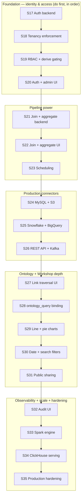

# ATLAS Phase 2 — Build Plan

Vertical slices, strictly ordered. Each slice ends in **running software** that is curl- and/or browser-verifiable. No slice may depend on a later slice to function. Phase 2 continues the slice numbering from Phase 1 (which ended at **S16**); Phase 2 runs **S17 → S35**.

Phase 2 turns the single-user local tool from Phase 1 into multi-user, multi-tenant, commercially deployable software, and delivers the capabilities the SPEC explicitly deferred: authentication, tenancy, RBAC, join/aggregate pipeline nodes, scheduling, production connectors, link traversal UI, `ontology_query` widget binding, additional chart/filter widgets, public dashboard sharing, the audit UI, Spark execution, a high-concurrency serving layer, and production hardening.

**Rules (carried forward from Phase 1):**

- One slice per coding session. Identify the current slice before writing code.
- Never start slice N+1 while slice N acceptance checks fail.
- Backend slices are curl-verifiable; UI slices add browser checks.
- No placeholder routes, pages, sidebar items, or modules outside the current slice.
- When implementation conflicts appear, prefer the smaller working version.
- The API envelope `{ data, error, meta }` and **never HTTP 200 with an error** rule still hold.
- Soft-delete, no-CASCADE, append-only event tables, and services-only business logic rules still hold.
- All new code keeps the existing seams intact: `ComputeEngine`, `Connector`, normalized lineage, tenancy columns, paginated APIs.

Canonical spec: [`SPEC.md`](SPEC.md). Phase 1 plan: [`BUILD_PLAN.md`](BUILD_PLAN.md). Decisions: [`DECISIONS.md`](DECISIONS.md).



> **Ordering note.** The foundation track (S17–S20) is a hard prerequisite for everything else: tenancy scoping, RBAC gating, and public-vs-authenticated distinctions all assume identity exists. After S20, tracks B (pipeline), C (connectors), D (semantic/workshop), and E (ops) are largely independent and **may be reordered by commercial priority**, but within each track the order is fixed. Keep one-slice-per-session discipline regardless of reordering.

---

## Risk register

| Risk | Retired in |
|------|------------|
| Retrofitting auth/tenancy onto existing Phase 1 endpoints without breaking the envelope or Phase 1 acceptance checks | S17–S18 |
| Backfilling `organization_id` / `created_by` on existing rows; scoping every existing query | S18 |
| RBAC enforcement consistency (route guard vs service guard); not leaking 403 vs 404 | S19 |
| Multi-input CTE correctness for `join`; grouping/aggregation SQL safety | S21 |
| Celery Beat reliability, missed/duplicate fires, timezone correctness | S23 |
| External connector credential handling, network egress, and driver licensing (Snowflake/BigQuery) | S24–S26 |
| Kafka streaming vs batch microbatch ingestion semantics into Iceberg | S26 |
| `ontology_query` resolution reuse without duplicating join logic | S28 |
| Public sharing access-control surface (token scope, no data leakage, no write paths) | S31 |
| Spark engine parity with DuckDB across the `ComputeEngine` Protocol | S33 |
| ClickHouse ↔ Iceberg sync correctness and query routing (serving cache, not system of record) | S34 |

---

## S17 — Authentication backend (users, sessions, login)

### Scope

- Migration: `users` table (`id`, `organization_id`, `email` unique-active, `password_hash`, `display_name`, `is_active`, timestamps, `deleted_at`) and `organizations` table (`id`, `name`, `slug`, timestamps, `deleted_at`).
- `backend/app/models/user.py`, `organization.py`
- `backend/app/schemas/auth.py`
- `backend/app/services/auth_service.py` — register (seed/admin only), authenticate, session issue/revoke, password hashing (argon2 or bcrypt via `passlib`).
- `backend/app/api/v1/auth.py` — `POST /auth/login`, `POST /auth/logout`, `GET /auth/me`, `POST /auth/refresh` (if token-based).
- `backend/app/dependencies.py` — `get_current_user` dependency (reads session/JWT); `get_optional_user`.
- Session store in Redis (opaque session token, httpOnly cookie) — see [PD01](#pd01--session-based-auth-with-httponly-cookies).
- `backend/scripts/create_admin.py` — bootstrap first org + admin user.
- `backend/tests/test_auth.py`

### Out of scope

Tenancy scoping of existing endpoints (S18), RBAC/permissions (S19), any frontend (S20), SSO/OAuth/SAML.

### Acceptance checks

```bash
# Bootstrap first org + admin
python backend/scripts/create_admin.py --email admin@example.com --password 'pw' --org Acme

# Login → sets session cookie / returns token
curl -s -c /tmp/cj.txt -X POST http://127.0.0.1:8000/api/v1/auth/login \
  -H 'Content-Type: application/json' \
  -d '{"email":"admin@example.com","password":"pw"}' | jq '.error'
# Expect: null

# Authenticated identity
curl -s -b /tmp/cj.txt http://127.0.0.1:8000/api/v1/auth/me | jq '.data.email'
# Expect: "admin@example.com"

# Wrong password → 401, envelope error, NO password echoed
curl -s -o /dev/null -w "%{http_code}" -X POST http://127.0.0.1:8000/api/v1/auth/login \
  -H 'Content-Type: application/json' -d '{"email":"admin@example.com","password":"bad"}'
# Expect: 401

# Unauthenticated /me → 401
curl -s -o /dev/null -w "%{http_code}" http://127.0.0.1:8000/api/v1/auth/me
# Expect: 401

pytest backend/tests/test_auth.py -q
# Expect: all pass
```

### Stop condition

Password or hash returned/logged anywhere; sessions not revocable; `/me` works without credentials; login returns 200 with an error body.

---

## S18 — Tenancy enforcement (organization scoping)

### Scope

- Request context: resolve `current_user` → `organization_id` for every authenticated request (dependency or middleware).
- Populate `organization_id` and `created_by` on **all** create paths across existing services (sources, datasets, pipelines, pipeline_runs, lineage_events, audit_events, ontology, dashboards, widgets).
- Add org filter to **all** existing read queries (alongside the existing `deleted_at IS NULL` filter).
- Reject cross-org reference (e.g. binding a widget to another org's dataset) → 404.
- Migration: backfill helper / data migration assigning existing Phase 1 rows to the bootstrap org; add composite indexes `(organization_id, deleted_at)` where hot.
- Update `audit_events` writes to carry `organization_id` and `actor`.
- `backend/tests/test_tenancy_isolation.py`

### Out of scope

Roles/permissions (S19), org-management UI (S20), schema-per-tenant isolation (shared-schema + `organization_id` only — see [PD02](#pd02--shared-schema-tenancy-via-organization_id)).

### Acceptance checks

```bash
# Two orgs, two users
python backend/scripts/create_admin.py --email a@x.com --password pw --org OrgA
python backend/scripts/create_admin.py --email b@y.com --password pw --org OrgB

# OrgA creates a source
curl -s -c /tmp/a.txt -X POST .../auth/login -d '{"email":"a@x.com","password":"pw"}' -H 'Content-Type: application/json' >/dev/null
SID=$(curl -s -b /tmp/a.txt -X POST .../api/v1/sources -H 'Content-Type: application/json' \
  -d '{"name":"a_src","source_type":"csv","config":{}}' | jq -r '.data.id')

# OrgB cannot see or fetch OrgA's source
curl -s -c /tmp/b.txt -X POST .../auth/login -d '{"email":"b@y.com","password":"pw"}' -H 'Content-Type: application/json' >/dev/null
curl -s -b /tmp/b.txt .../api/v1/sources | jq '.data | length'      # Expect: 0
curl -s -b /tmp/b.txt -o /dev/null -w "%{http_code}" .../api/v1/sources/${SID}   # Expect: 404

# Created rows carry org + creator
docker compose exec postgres psql -U atlas -d atlas -c \
  "SELECT organization_id IS NOT NULL, created_by IS NOT NULL FROM data_sources WHERE id='${SID}';"
# Expect: t | t

pytest backend/tests/test_tenancy_isolation.py -q
```

### Stop condition

Any endpoint returns rows from another org; create path leaves `organization_id` NULL for authenticated users; cross-org reference accepted; Phase 1 acceptance checks (S01–S16) regress under a single seeded org.

---

## S19 — RBAC (roles, permissions, derive gating)

### Scope

- Migration: `roles` (seeded: `admin`, `editor`, `viewer`), `memberships` (`user_id`, `organization_id`, `role_id`).
- `backend/app/services/authz_service.py` — permission resolution per (user, org).
- Permission map: read (all roles), write/create/update/soft-delete (editor+admin), run pipeline (editor+admin), manage users/roles (admin), **`derive` transform authoring (editor+admin only)** — fulfils [DECISIONS D05](DECISIONS.md) follow-through.
- Route/service guards: `require_permission(...)`; consistent 403 (authenticated, not allowed) vs 404 (not in org).
- `backend/tests/test_rbac.py`, `backend/tests/test_derive_gating.py`

### Out of scope

Resource-level / row-level ACLs (org+role only), custom role builder UI, the admin UI itself (S20).

### Acceptance checks

```bash
# viewer can read but not write
curl -s -b /tmp/viewer.txt .../api/v1/sources | jq '.error'                 # Expect: null
curl -s -b /tmp/viewer.txt -o /dev/null -w "%{http_code}" -X POST .../api/v1/sources \
  -H 'Content-Type: application/json' -d '{"name":"x","source_type":"csv","config":{}}'
# Expect: 403

# viewer cannot create a pipeline containing a derive node
curl -s -b /tmp/viewer.txt -o /dev/null -w "%{http_code}" -X POST .../api/v1/pipelines \
  -H 'Content-Type: application/json' -d @/tmp/derive_pipeline.json
# Expect: 403

# editor can create derive pipeline
curl -s -b /tmp/editor.txt -X POST .../api/v1/pipelines \
  -H 'Content-Type: application/json' -d @/tmp/derive_pipeline.json | jq '.error'
# Expect: null

pytest backend/tests/test_rbac.py backend/tests/test_derive_gating.py -q
```

### Stop condition

A `viewer` performs any write; `derive` authoring allowed for viewers; 403 leaks existence of out-of-org resources (must be 404); permission checks live in routes only with services unguarded.

---

## S20 — Auth + admin/org UI

### Scope

- `frontend/src/api/auth.ts`, `frontend/src/api/admin.ts`
- `frontend/src/stores/auth-store.ts` (UI/session state only; identity itself comes from `/auth/me` via TanStack Query).
- `frontend/src/pages/Login.tsx`; protected-route wrapper around the app shell; redirect unauthenticated → `/login`.
- `client.ts`: attach credentials, handle 401 (redirect to login) and 403 (toast/inline) globally.
- Real user menu (current user, org name, logout). Org switcher if user has multiple memberships.
- `frontend/src/pages/admin/Users.tsx`, `Members.tsx` — admin-only: invite/create user, assign role (gated by `manage_users`).
- Sidebar: **Admin** section visible to admins only; hide write actions for viewers.

### Out of scope

Self-service signup, password reset email flows (admin sets passwords), SSO UI.

### Acceptance checks

1. Visit app while logged out → redirected to `/login`; skeleton then login form.
2. Log in → land in app; user menu shows email + org; logout returns to `/login`.
3. As `viewer`: create/delete buttons hidden or disabled; attempting a guarded action surfaces a clear 403 message (no crash).
4. As `admin`: Admin → Users shows members; assign `editor` role to a user → that user can now create.
5. Network tab: all calls go through TanStack Query hooks; 401 anywhere bounces to login.

### Stop condition

Server identity stored in Zustand instead of TanStack Query; routes reachable without auth; admin pages visible to non-admins; `any` types or direct axios in components.

---

## S21 — Pipeline transforms: join + aggregate (backend)

### Scope

- Implement the two Phase 2 transforms documented in SPEC: `aggregate` (`group_by`, `aggregations: [{column, func, alias}]`) and `join` (`right_node_id`, `left_on`, `right_on`, `how`).
- `validator.py`: multi-input nodes allowed for `join` (exactly two inputs); aggregate single-input; reject unknown agg funcs; reject join on missing columns at validation where statically knowable.
- `transforms.py` / CTE builder: multi-input CTE pattern, `GROUP BY` with quoted identifiers, parameterized everywhere, alias sanitization, join key quoting; `how` ∈ inner/left/right/full.
- `backend/tests/test_join_transform.py`, `test_aggregate_transform.py`; extend `test_dag_validation.py`, `test_transform_sql.py`.

### Out of scope

Builder UI (S22), cross-engine pushdown, window functions, multi-key fuzzy joins.

### Acceptance checks

```bash
# Aggregate pipeline: source → aggregate(group_by region, sum amount) → output
curl -s -b /tmp/editor.txt -X POST .../api/v1/pipelines -H 'Content-Type: application/json' \
  -d @/tmp/agg_pipeline.json | jq '.data.id'
# Run → success; output dataset row_count == distinct(region)

# Join pipeline: two sources → join(on id) → output
RUN_ID=$(curl -s -b /tmp/editor.txt -X POST .../api/v1/pipelines/${JOIN_PIPELINE}/run | jq -r '.data.run_id')
curl -s -b /tmp/editor.txt .../api/v1/pipelines/runs/${RUN_ID} | jq '.data.status'
# Expect: "success"

# Validation: join with one input → 400 before queue
pytest backend/tests/test_join_transform.py backend/tests/test_aggregate_transform.py \
  backend/tests/test_dag_validation.py backend/tests/test_transform_sql.py -q
```

### Stop condition

Filter/join values string-interpolated into SQL; join accepts other than two inputs; aggregate alias or group columns unquoted; validator queues an invalid multi-input DAG.

---

## S22 — Pipeline builder UI: join + aggregate nodes

### Scope

- Palette entries + config panels for `aggregate` and `join` in the existing pipeline builder.
- Join node accepts two incoming edges in React Flow; config picks left/right keys and `how`; aggregate config builds `group_by` + aggregation rows.
- Validation feedback in UI mirrors backend 400 reasons.

### Out of scope

New transform types beyond join/aggregate; auto-layout improvements unrelated to multi-input.

### Acceptance checks

1. Build source A + source B → Join (configure keys, `how=inner`) → Output → Save; reload → two-input edge persists.
2. Build source → Aggregate (group_by + sum) → Output → Save → Run → success badge.
3. Invalid join (single input) blocked with the backend's error shown inline.

### Stop condition

Canvas loses the second join input on reload; run triggered without persisted multi-input DAG.

---

## S23 — Pipeline scheduling

### Scope

- Honor existing `pipeline_definitions.schedule_cron`; add Celery Beat (or equivalent) service to `docker-compose.yml`.
- `backend/app/workers/beat.py` (or scheduler config); register/update/remove schedules when a pipeline's cron changes.
- API: `PUT /api/v1/pipelines/{id}` accepts/updates `schedule_cron`; runs created by schedule set `triggered_by='schedule'`.
- Timezone-correct cron; missed-fire policy documented; no duplicate concurrent runs for the same pipeline (lock).
- `frontend`: schedule field in pipeline editor; "Next run" display; run history shows trigger source badge.
- `backend/tests/test_schedule_parsing.py`

### Out of scope

Backfills, calendar UI, per-step retries, event-driven triggers.

### Acceptance checks

```bash
# Set a 1-minute cron
curl -s -b /tmp/editor.txt -X PUT .../api/v1/pipelines/${PID} -H 'Content-Type: application/json' \
  -d '{"schedule_cron":"* * * * *"}' | jq '.data.schedule_cron'

# Within ~90s a scheduled run appears
sleep 90
curl -s -b /tmp/editor.txt ".../api/v1/pipelines/${PID}/runs?page=1" \
  | jq '[.data[] | select(.triggered_by=="schedule")] | length'
# Expect: >= 1

# Clearing cron stops new scheduled runs
curl -s -b /tmp/editor.txt -X PUT .../api/v1/pipelines/${PID} -H 'Content-Type: application/json' \
  -d '{"schedule_cron":null}' | jq '.data.schedule_cron'   # Expect: null
```

### Stop condition

Invalid cron accepted; overlapping runs of the same pipeline; schedule survives pipeline soft-delete; scheduled runs missing `triggered_by='schedule'` or audit rows.

---

## S24 — Connectors: MySQL + S3

### Scope

- Promote `mysql` and `s3` stubs to real `Connector` implementations (`test_connection`, `list_tables`, `get_schema`, `read_table`).
- MySQL: driver + connection string config; read into PyArrow; no arbitrary user SQL (parity with PostgreSQL connector).
- S3: list objects under a prefix; read CSV/Parquet objects into PyArrow; path-style + region config; credentials encrypted (Fernet), decrypted only in service layer.
- Egress timeouts and clear connection-failure errors (no credential leakage in messages).
- `backend/tests/test_connector_mysql.py`, `test_connector_s3.py` (mocked / testcontainers as available).

### Out of scope

Snowflake/BigQuery (S25), REST/Kafka (S26), incremental/CDC ingestion.

### Acceptance checks

```bash
# Create a MySQL source, test connection
curl -s -b /tmp/editor.txt -X POST .../api/v1/sources -H 'Content-Type: application/json' \
  -d '{"name":"mysql_demo","source_type":"mysql","config":{"host":"...","user":"...","password":"...","database":"..."}}' \
  | jq '.data.id'
curl -s -b /tmp/editor.txt -X POST .../api/v1/sources/${MYSQL_ID}/test | jq '.data.ok'   # Expect: true
curl -s -b /tmp/editor.txt .../api/v1/sources/${MYSQL_ID}/schema | jq '.data.tables[0].columns | length'  # Expect: > 0

# Ingest from S3 prefix
curl -s -b /tmp/editor.txt -X POST .../api/v1/datasets/ingest -H 'Content-Type: application/json' \
  -d '{"source_id":"'"${S3_ID}"'","table_or_file":"path/to/file.parquet","dataset_name":"s3_ds","display_name":"S3 DS","mode":"create"}' \
  | jq '.data.row_count'   # Expect: > 0
```

### Stop condition

Credentials in logs/responses/error messages; connector returns HTTP 200 with an error body; arbitrary SQL allowed against MySQL; ingest succeeds without lineage/audit rows.

---

## S25 — Connectors: Snowflake + BigQuery

### Scope

- Promote `snowflake` and `bigquery` stubs to real connectors (same Protocol).
- Snowflake: account/warehouse/role/db/schema config; key-pair or password auth; read into PyArrow.
- BigQuery: service-account JSON (stored encrypted); project/dataset config; read via Storage/Query API into PyArrow.
- Driver/dependency licensing noted in `requirements.txt`; large-result read uses a configurable row/byte cap.
- `backend/tests/test_connector_snowflake.py`, `test_connector_bigquery.py` (mocked).

### Out of scope

Pushdown of ATLAS pipeline transforms into the warehouse; write-back to warehouses.

### Acceptance checks

```bash
curl -s -b /tmp/editor.txt -X POST .../api/v1/sources/${SF_ID}/test | jq '.data.ok'   # Expect: true
curl -s -b /tmp/editor.txt .../api/v1/sources/${BQ_ID}/schema | jq '.data.tables | length'  # Expect: > 0
# Ingest a small table from each → dataset created with correct row_count + lineage event
```

### Stop condition

Service-account JSON or warehouse credentials surfaced anywhere; unbounded read with no cap; stub still raising `NotImplementedError` for these two types.

---

## S26 — Connectors: REST API + Kafka

### Scope

- `rest_api` connector: configurable base URL, auth header (encrypted), pagination strategy, JSON→tabular flattening into PyArrow; `list_tables` maps to configured endpoints.
- `kafka` connector: **batch microbatch** ingestion (bounded poll: topic + consumer group + max records/time window) into PyArrow, then standard Iceberg ingest — see [PD03](#pd03--kafka-as-bounded-microbatch-ingest-not-streaming). Not a continuous stream in Phase 2.
- Encrypted credentials, egress timeouts, clear errors.
- `backend/tests/test_connector_rest.py`, `test_connector_kafka.py` (mocked broker / mock HTTP).

### Out of scope

Continuous/streaming ingestion, exactly-once semantics, schema-registry integration, webhook push ingestion.

### Acceptance checks

```bash
# REST source ingest
curl -s -b /tmp/editor.txt -X POST .../api/v1/datasets/ingest -H 'Content-Type: application/json' \
  -d '{"source_id":"'"${REST_ID}"'","table_or_file":"/v1/orders","dataset_name":"rest_orders","display_name":"REST Orders","mode":"create"}' \
  | jq '.data.row_count'   # Expect: >= 0

# Kafka bounded poll ingest (max_records window)
curl -s -b /tmp/editor.txt -X POST .../api/v1/datasets/ingest -H 'Content-Type: application/json' \
  -d '{"source_id":"'"${KAFKA_ID}"'","table_or_file":"orders_topic","dataset_name":"kafka_orders","display_name":"Kafka Orders","mode":"create"}' \
  | jq '.data.row_count'   # Expect: >= 0 and bounded by configured window
```

### Stop condition

Kafka consumer runs unbounded / blocks the worker; REST credentials in logs; ingest bypasses lineage/audit; flattening crashes on nested JSON instead of erroring cleanly.

---

## S27 — Ontology: link traversal UI

### Scope

- Build the UI for the existing Phase 1 link-traversal API (`GET /ontology/types/{id}/objects/{pk}/links/{link_type_id}`).
- Object Browser detail: from an object instance, show outgoing/incoming links by `link_type`; navigate to linked object instance(s) respecting cardinality.
- Breadcrumb/back stack for traversal; paginated linked results; empty/error states.
- `frontend/src/components/ontology/LinkTraversalPanel.tsx`, object instance detail route.

### Out of scope

New link semantics, graph-wide path finding, write/edit of links from the browser (link CRUD already exists from Phase 1).

### Acceptance checks

1. Open an object instance with a configured link → linked objects listed under the link's display name.
2. Click a linked object → navigates to that instance; breadcrumb reflects the path; back returns.
3. One-to-many link shows paginated children; missing PK / incomplete mapping shows the existing 400 error (loud, not blank).

### Stop condition

Traversal infers joins; partial results shown when PK mapping incomplete; silent empty panel on error.

---

## S28 — Workshop: `ontology_query` widget binding

### Scope

- Implement `source_type: 'ontology_query'` in `POST /analytics/widgets/{id}/data`, reusing `ontology_service` object resolution (no duplicate join logic) — closes the Phase 1 gap where only `source_type: 'dataset'` was supported.
- Binding fields: `object_type_id`, `properties[]`, `filters[]`, `limit`; respects PK/mapping rules (400 on incomplete) and tenancy.
- Frontend `WidgetConfigPanel`: data-binding source toggle (dataset | ontology_query); object-type + property pickers.
- Works for already-shipped widgets (table, metric_card, bar_chart) without per-widget special-casing.
- `backend/tests/test_widget_ontology_binding.py`

### Out of scope

New widget types (S29), filter widgets over ontology (covered by existing filter merge), link-based widget binding.

### Acceptance checks

```bash
# Bind a table widget to an object type
curl -s -b /tmp/editor.txt -X POST .../api/v1/analytics/widgets/${WID}/data \
  -H 'Content-Type: application/json' \
  -d '{"binding":{"source_type":"ontology_query","object_type_id":"'"${TYPE}"'","properties":["id","name"]},"filters":[]}' \
  | jq '.data.rows | length'   # Expect: >= 0

# Object type without PK → 400
curl -s -b /tmp/editor.txt -o /dev/null -w "%{http_code}" -X POST .../api/v1/analytics/widgets/${WID}/data \
  -H 'Content-Type: application/json' \
  -d '{"binding":{"source_type":"ontology_query","object_type_id":"'"${NOPK_TYPE}"'"},"filters":[]}'
# Expect: 400
```

### Stop condition

Join logic duplicated instead of reusing ontology resolution; incomplete-mapping returns partial data; cross-org object type readable; dataset binding regresses.

---

## S29 — Workshop: line chart + pie chart widgets

### Scope

- Backend aggregation paths for `line_chart` and `pie_chart` in the widget data endpoint (CHECK constraint already includes them).
- `frontend/src/components/workshop/widgets/LineChartWidget.tsx`, `PieChartWidget.tsx` (Recharts); palette entries.
- Reuse the existing dataset/ontology binding + filter-merge data path.

### Out of scope

Date/search filter widgets (S30), combo/stacked chart variants beyond the basics.

### Acceptance checks

1. Add a line chart (x = time/categorical, y = numeric, aggregation sum) → renders series; empty x shows empty state.
2. Add a pie chart (category + value) → renders slices with readable legend.
3. Both respect active dropdown filters from S14.

### Stop condition

Charts bypass the shared data path; crash (instead of empty state) on no data; started before earlier widget slices verified.

---

## S30 — Workshop: date-range + search filter widgets

### Scope

- New `filter_type` values: `date_range` and `search` (the SPEC's Phase 2 filter types), added to the existing filter widget.
- Backend filter-merge handles range (gte/lte on a date column) and search (substring/ILIKE, parameterized) — extends DECISIONS A4 merge semantics.
- `FilterWidget.tsx`: date-range picker and search input UI; `applies_to` targeting unchanged.

### Out of scope

Relative-date presets beyond a basic set, multi-column search, saved filter sets.

### Acceptance checks

1. Add a date-range filter over a date column applied to a table + chart → selecting a range re-queries both within bounds.
2. Add a search filter over a text column → typing filters bound widgets (debounced, parameterized).
3. Clearing filters restores full results; viewer route honors both new filter types.

### Stop condition

Search/range values string-interpolated into SQL; filters don't propagate to `applies_to` targets; viewer can't use the new filters.

---

## S31 — Workshop: public dashboard sharing

### Scope

- Re-enable the deferred sharing surface using existing `dashboards.is_public` / `public_token` columns.
- `POST /api/v1/analytics/dashboards/{id}/publish` (toggle public, (re)generate token) — admin/editor only.
- `GET /api/v1/analytics/public/{token}` and widget-data-by-token — **read-only, no auth, org-scoped to the dashboard's org, no write paths, no other org data reachable**.
- Frontend: Share button in builder; `/public/{token}` viewer route (read-only, filters work, no config/drag).
- `backend/tests/test_public_sharing.py`

### Out of scope

Per-viewer access controls, embed SDK, password-protected links, expiring tokens (note as future).

### Acceptance checks

```bash
# Publish
TOKEN=$(curl -s -b /tmp/editor.txt -X POST .../api/v1/analytics/dashboards/${DASH}/publish | jq -r '.data.public_token')

# Public read works WITHOUT auth
curl -s ".../api/v1/analytics/public/${TOKEN}" | jq '.error'   # Expect: null

# Public token cannot reach other dashboards or any write route
curl -s -o /dev/null -w "%{http_code}" -X PUT ".../api/v1/analytics/dashboards/${DASH}" -d '{}' -H 'Content-Type: application/json'
# Expect: 401/403 (no auth)

# Unpublish → token 404s
curl -s -b /tmp/editor.txt -X POST .../api/v1/analytics/dashboards/${DASH}/publish -d '{"is_public":false}' -H 'Content-Type: application/json' >/dev/null
curl -s -o /dev/null -w "%{http_code}" ".../api/v1/analytics/public/${TOKEN}"   # Expect: 404
```

### Stop condition

Public token exposes write routes, other dashboards, or cross-org data; token not revocable; published dashboard leaks bound dataset rows outside its org.

---

## S32 — Audit UI

### Scope

- Surface the `audit_events` history accumulated since Phase 1 (closes the Phase 1 "no audit UI" gap).
- `backend`: `GET /api/v1/audit` (paginated, filter by `entity_type`, `entity_id`, `action`, date range) — admin-only, org-scoped.
- `frontend/src/api/audit.ts`, `frontend/src/pages/admin/Audit.tsx`; per-entity audit tab on source/dataset/pipeline/dashboard detail pages.
- Render `actor` (now populated since S18), action, entity, timestamp, payload diff.

### Out of scope

Export, tamper-evidence/signing, retention policies.

### Acceptance checks

```bash
curl -s -b /tmp/admin.txt ".../api/v1/audit?entity_type=data_source&page=1" | jq '.meta.total'  # Expect: >= 1
curl -s -b /tmp/viewer.txt -o /dev/null -w "%{http_code}" ".../api/v1/audit"                     # Expect: 403
```

Browser: Admin → Audit lists recent create/update/delete/run events with actor; entity detail page shows its own audit trail; pagination works.

### Stop condition

Audit visible to non-admins; events from other orgs shown; payload exposes decrypted credentials.

---

## S33 — Spark compute engine

### Scope

- De-risk first: `backend/scripts/prove_spark_roundtrip.py` — Spark reads an Iceberg table from MinIO and writes back, mirroring the Phase 1 DuckDB proof.
- Implement `SparkEngine` against the existing `ComputeEngine` Protocol (`query`, `read_iceberg`, `write_iceberg`, `profile`); keep it registered in `ENGINES`.
- Engine selection via settings (per-deployment default still DuckDB); pipeline executor unchanged except engine resolution.
- `spark` service in `docker-compose.yml` (or external cluster config via settings; no localhost in app code).
- `backend/tests/test_spark_engine.py` (smoke; skipped when Spark unavailable).

### Out of scope

Replacing DuckDB as default; Spark-only transforms; autoscaling; YARN/K8s submission tuning.

### Acceptance checks

```bash
python backend/scripts/prove_spark_roundtrip.py   # Expect: exit 0, row-count match

# Run an existing pipeline with engine=spark → identical output dataset row_count vs duckdb
ATLAS_COMPUTE_ENGINE=spark <run pipeline>   # success; rows_written matches duckdb run
pytest backend/tests/test_spark_engine.py -q
```

### Stop condition

Spark path diverges from `ComputeEngine` Protocol; engine choice hardcoded; services rewritten to special-case Spark; proof script fails to read Iceberg from MinIO.

---

## S34 — ClickHouse high-concurrency serving layer

### Scope

- Add ClickHouse as a **serving cache for dashboard reads only** — not a system of record — see [PD04](#pd04--clickhouse-is-a-serving-cache-not-system-of-record).
- Sync path: materialize widget-bound datasets (Iceberg) into ClickHouse tables on dataset update / pipeline success; track freshness.
- Widget data endpoint routes reads to ClickHouse when a fresh copy exists, else falls back to DuckDB/Iceberg (correctness over speed).
- `clickhouse` service in `docker-compose.yml`; connection via settings.
- `backend/tests/test_serving_routing.py` (routing + fallback correctness).

### Out of scope

ClickHouse as ingestion target for pipelines; real-time CDC sync; replacing DuckDB for pipeline execution; cross-engine joins.

### Acceptance checks

```bash
# After a dataset is materialized, widget data served from ClickHouse
curl -s -b /tmp/editor.txt -X POST .../api/v1/analytics/widgets/${WID}/data -H 'Content-Type: application/json' -d '{...}' \
  | jq '.meta.served_by'   # Expect: "clickhouse"

# Stale/missing materialization falls back, still correct
# (drop CH copy) → same query returns identical rows with meta.served_by == "duckdb"
pytest backend/tests/test_serving_routing.py -q
```

### Stop condition

ClickHouse treated as source of truth; stale data served with no freshness check or fallback; results differ between ClickHouse and DuckDB for the same query; lineage/audit bypassed by the sync.

---

## S35 — Production hardening & deployment

### Scope

- Reverse-proxy/TLS termination config (e.g. Caddy/Traefik/nginx) in a production compose/profile; all hosts/ports from settings (no localhost in app code).
- Rate limiting on auth + public endpoints; security headers (HSTS, CSP baseline, secure cookies in prod).
- Secrets management: Fernet key + DB/object-store credentials sourced from env/secret store; documented rotation.
- Healthchecks for all services; structured logging with org/actor context (never credentials); backup guidance for Postgres + MinIO.
- `docs/DEPLOYMENT.md` (runbook) and `.env.production.example`.

### Out of scope

Full HA/multi-node orchestration, autoscaling, managed-service IaC, pen-test remediation backlog.

### Acceptance checks

1. Bring up the production profile → all services healthy behind the proxy over TLS.
2. Auth endpoint rate limit triggers after the configured threshold (429).
3. Secrets absent from image and logs; rotating the Fernet key procedure documented and exercised on a test source.
4. Security review subagent on the diff returns no critical findings.

### Stop condition

Secrets baked into images or logged; cookies not `Secure`/`HttpOnly` in prod; any app code assuming localhost; no documented backup/restore path.

---

## Phase 2 non-goals (explicit)

Do not implement in Phase 2: self-service signup / public registration, SSO/SAML/OAuth providers, fine-grained row-level or column-level security, schema-per-tenant physical isolation, continuous/streaming (always-on) ingestion, exactly-once stream processing, CDC/incremental sync, warehouse transform pushdown, write-back to external warehouses, AI features of any kind, multi-region/HA orchestration, mobile apps, an embed SDK, expiring/password-protected share links, window functions or multi-key fuzzy joins, and graph-wide ontology path finding.

---

## Decisions to confirm before starting (Phase 2)

Smallest defensible defaults, mirroring the Phase 1 "Assumptions flagged for review" pattern. Confirm or revise before the dependent slice ships. These should graduate into [`DECISIONS.md`](DECISIONS.md) (suggested IDs D13+) once accepted.

### PD01 — Session-based auth with httpOnly cookies

**Assumption:** Opaque session tokens stored in Redis, delivered as `Secure`/`HttpOnly` cookies; logout and role changes revoke sessions server-side. Chosen over stateless JWT because Redis already exists and revocation matters for RBAC. **Review before:** S17.

### PD02 — Shared-schema tenancy via `organization_id`

**Assumption:** Multi-tenancy is shared-schema with mandatory `organization_id` scoping (columns already present since Phase 1), not schema-per-tenant or DB-per-tenant. **Review before:** S18.

### PD03 — Kafka as bounded microbatch ingest, not streaming

**Assumption:** The `kafka` connector performs a bounded poll (max records / time window) per ingest call, then a normal Iceberg write. No always-on consumer in Phase 2. **Review before:** S26.

### PD04 — ClickHouse is a serving cache, not system of record

**Assumption:** Iceberg remains the system of record; ClickHouse holds materialized copies for high-concurrency dashboard reads only, with freshness tracking and DuckDB/Iceberg fallback. **Review before:** S34.

### PD05 — RBAC is org + role, not resource-level

**Assumption:** Phase 2 RBAC is coarse (admin/editor/viewer per org). Resource- and row-level ACLs are deferred. `derive` authoring requires editor+ (fulfilling Phase 1 DECISIONS D05). **Review before:** S19.

---

## Slice summary (one line each)

| Slice | Summary |
|-------|---------|
| S17 | Auth backend: users, orgs, sessions, login/logout/me |
| S18 | Tenancy enforcement: org scoping + created_by on all paths |
| S19 | RBAC: roles, permissions, guards, gate `derive` |
| S20 | Auth + admin/org UI; protected routes; 401/403 handling |
| S21 | Join + aggregate transforms (backend, multi-input CTE) |
| S22 | Join + aggregate nodes in pipeline builder UI |
| S23 | Pipeline scheduling (Celery Beat + schedule API/UI) |
| S24 | Connectors: MySQL + S3 (real implementations) |
| S25 | Connectors: Snowflake + BigQuery |
| S26 | Connectors: REST API + Kafka (bounded microbatch) |
| S27 | Ontology link traversal UI |
| S28 | `ontology_query` widget binding (backend + UI) |
| S29 | Line chart + pie chart widgets |
| S30 | Date-range + search filter widgets |
| S31 | Public dashboard sharing (publish + public viewer) |
| S32 | Audit UI (admin + per-entity trails) |
| S33 | Spark compute engine (proof + impl behind ComputeEngine) |
| S34 | ClickHouse high-concurrency serving layer |
| S35 | Production hardening & deployment |
